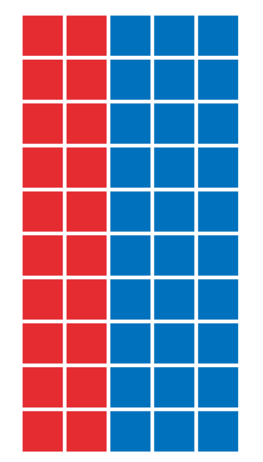

# Scope of the seminar

## Data Science im digitalen Unternehmen der Zukunft
## Data Science im digitalen Unternehmen
## Data Science
## Data Literacy
- Data literacy is the ability to read, understand, create and communicate data as information

# Fields of Data Science
## BI
## AI
## API
  - Data in applications
  - Self service
  - Server / client infrastructure

# Business Intelligence / Data Analysis

# Range of Data Responsibilities in a company
## Provide and maintain servers
  - Minimal amount of servers
  - Manage users
  - Maintain databases / DW
  - Secure the servers
  - Job Title: Data Engineer / DevOps

## Develop and maintain data flows
  - ETL: Extract, Transform, Load
  - Unstructured data → structured data
  - Batch processing vs. data streams
  - Make data easy accesible for Data Analysts
  - Monitor data pipelines
  - Raw data vs. aggregated data
  - Building caches vs. on-demand
  - Job Title: Data Engineer / Data Architect
  
## Derive value from data
  - Ad Hoc Analysis vs. Automated Analysis
  - Data vizualization
  - Dashboards
  - KPI
  
## Key Performace Indicators
  - **S**pecific
  - **M**easurable  
  - **A**chievable 
  - **R**elevant 
  - **T**ime phased
  
## KPI: Product Management
  - DAU, WAU, MAU → daily, weekly, monthly users
  - Retention
  - Churn
  - Tourists
  - Return rate
  - Paying Customers (VIPs, Whales)
  - Overall Sales (Case: Happy Hour)

## KPI: Sales / Marketing
  - Conversion (Funnel)
  - LTV → live time value
  - Cohort Analysis
  - ROI → Return on invest (LTV / Cost per Acquisition)

## Case study: A/B testing
  - Strictly stick to groups
  - No self selection allowed
  - Optimal size?
  - Statistical vs. economical significance
  - Control the environment
  - Sequential A/B testing?

## KPI: Human Resources
  - Employer turnover
  - Applications
  - Conversion (Ad → Application)
  - Employer performance indicator
  
## KPI: Developer (Case Study: Game Design at Ubisoft)
  - Level Dropout
  - Time to completion
  - Completion (success) rate
  - Adoption of features
  
## Summary: Different Data Jobs
  - whodoeswhat.png
  - Flaws of last chart?
  
# Data Analysis
## Data Fallacies

## Cherry picking
  - Show only a subset of data that fit your claim
  - Malign manipulation or [confirmation bias](https://www.instagram.com/p/Bjz0RKtAMFp/)
  - Case study: Echo chamber, american economy, refugee crisis
  - Strategy: What I am not being told?
  - Strategic influence of data scientists in a company

## Data Dredging
  - Designing hypothesis *after* testing
  - Example: [xkcd comic](https://xkcd.com/882)
  - Strategy: Preregistering results
  - Strategy: Bonferroni correction
  
## Survivorship bias {data-background="Survivorship-bias.png"}

## Spurious correlation {data-background="storch.jpg"}
- [Examples](http://www.tylervigen.com/spurious-correlations)

## {data-background="1908.png"}
  
## Gerrymandering 
{height=600px}

## Gerrymandering
{height=600px}

## Gerrymandering
  - Beware of unintentional Gerrymandering in survey design
  - Case study: Winter event
  - [Great Article](https://www.nytimes.com/interactive/2017/10/03/upshot/how-the-new-math-of-gerrymandering-works-supreme-court.html)
  
## Sampling and survey biases
  - Response bias (case: Flattr)
  - Undercoverage
  - Self-selection bias (voluntary response)
  - Convenience sampling
  - Non-response
  - Biased wording
  - Survey fatigue
  - Not paying attention
  - Order bias (Case study: Mobile study - ranking of ad annoyance)
  - Forced answer (no possibility to be neutral)
  - Short self test: http://bit.do/surveybias
  
## Gambler fallacy
  - Independent probabilities
  - No cosmic force to balance things out
  - Case: Monte Carlo in 1913: 26 times black
  - Case: 10 y/o me playing dice
  
## Simpsons paradox
  - (Weighted) arithmetical means are weird
  - Case: Rich person moving towns
  
## . {data-background="simpson.png"}

## McNamara Fallacy
  - Dont loose big picture over data
  - Data Scientist is ideally the last person who believes in data
  - KPI blindness
  - Always ask yourself and your stakeholder:
  - *What action is based on the dacta*?
  - *What results do you expect?*
  - *Why do you want to rely on quantitative rather than qualittive results?*
  
## Overfitting
Overfitting is when you have a complicated model that gives worse predictions, on average, than a simpler model.
  - Case: Playing Fifa
  - Split your data to sample and test data (80/20 rule)
  
## Publication bias
  - In company: Stakeholder bias?
  
## Summary bias
**Dont trust data summaries for comparison; always visualize**
{height=500px}

  