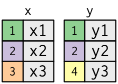

# Scope of the seminar

## Data Science im digitalen Unternehmen der Zukunft
## Data Science im digitalen Unternehmen
## Data Science
## Data Literacy
- Data literacy is the ability to read, understand, create and communicate data as information

# Fields of Data Science
## BI
## AI
## API
  - Data in applications
  - Self service
  - Server / client infrastructure

# Business Intelligence / Data Analysis

# Range of Data Responsibilities in a company
## Provide and maintain servers
  - Minimal amount of servers
  - Manage users
  - Maintain databases / DW
  - Secure the servers
  - Job Title: Data Engineer / DevOps

## Develop and maintain data flows
  - ETL: Extract, Transform, Load
  - Unstructured data → structured data
  - Batch processing vs. data streams
  - Make data easy accessible for Data Analysts
  - Monitor data pipelines
  - Raw data vs. aggregated data
  - Building caches vs. on-demand
  - Job Title: Data Engineer / Data Architect
  
## Derive value from data
  - Ad Hoc Analysis vs. Automated Analysis
  - Data visualization
  - Dashboards
  - KPI
  
## Key Performace Indicators
  - **S**pecific
  - **M**easurable  
  - **A**chievable 
  - **R**elevant 
  - **T**ime phased
  
## KPI: Product Management
  - DAU, WAU, MAU → daily, weekly, monthly users
  - Retention
  - Churn
  - Tourists
  - Return rate
  - Paying Customers (VIPs, Whales)
  - Overall Sales (Case: Happy Hour)

## KPI: Sales / Marketing
  - Conversion (Funnel)
  - LTV → live time value
  - Cohort Analysis
  - ROI → Return on invest (LTV / Cost per Acquisition)

## Case study: A/B testing
  - Strictly stick to groups
  - No self selection allowed
  - Optimal size?
  - Statistical vs. economical significance
  - Control the environment
  - Sequential A/B testing?

## KPI: Human Resources
  - Employer turnover
  - Applications
  - Conversion (Ad → Application)
  - Employer performance indicator
  
## KPI: Developer (Case Study: Game Design at Ubisoft)
  - Level Dropout
  - Time to completion
  - Completion (success) rate
  - Adoption of features
  
## Summary: Different Data Jobs
  - whodoeswhat.png
  - Flaws of last chart?
  
# Data Analysis
## Data Fallacies

## Cherry picking
  - Show only a subset of data that fit your claim
  - Malign manipulation or [confirmation bias](https://www.instagram.com/p/Bjz0RKtAMFp/)
  - Case study: Echo chamber, american economy, refugee crisis
  - Strategy: What I am not being told?
  - Strategic influence of data scientists in a company

## Data Dredging
  - Designing hypothesis *after* testing
  - Example: [xkcd comic](https://xkcd.com/882)
  - Strategy: Preregistering results
  - Strategy: Bonferroni correction
  
## Survivorship bias {data-background="Survivorship-bias.png"}

## Spurious correlation {data-background="storch.jpg"}
- [Examples](http://www.tylervigen.com/spurious-correlations)

## {data-background="1908.png"}
  
## Gerrymandering 
{height=600px}

## Gerrymandering
{height=600px}

## Gerrymandering
  - Beware of unintentional Gerrymandering in survey design
  - Case study: Winter event
  - [Great Article](https://www.nytimes.com/interactive/2017/10/03/upshot/how-the-new-math-of-gerrymandering-works-supreme-court.html)
  
## Sampling and survey biases
  - Response bias / Hawthorne effect (case: Flattr)
  - Undercoverage
  - Self-selection bias (voluntary response)
  - Convenience sampling
  - Non-response
  - Biased wording
  - Survey fatigue
  - Not paying attention
  - Order bias (Case study: Mobile study - ranking of ad annoyance)
  - Forced answer (no possibility to be neutral)
  - Short self test: http://bit.do/surveybias
 
## Sampling and survey bias cont.
 
  - ‘satisficing’: acquiescence, straight-lining, choosing the first reasonable response, or saying ‘don’t know’ or ‘no opinion’, skipping, speeding by giving low-effort responses, not fully answering open-text questions
  - Solution: attention checks
  - Problem: Removing "bad" participants → skewed demographics (psychographics)
  - Problem: Hawthorne effect?
  - Problem: Respondent recognizes check: low effort (past the trap, reduced trust)
  
## Gambler fallacy
  - Independent probabilities
  - No cosmic force to balance things out
  - Case: Monte Carlo in 1913: 26 times black
  - Case: 10 y/o me playing dice
  
## Simpsons paradox
  - (Weighted) arithmetical means are weird
  - Case: Rich person moving towns
  
## . {data-background="simpson.png"}

## McNamara Fallacy
  - Don't loose big picture over data
  - Data Scientist is ideally the last person who believes in data
  - KPI blindness
  - Always ask yourself and your stakeholder:
  - *What action is based on the dacta*?
  - *What results do you expect?*
  - *Why do you want to rely on quantitative rather than qualittive results?*
  
## Overfitting
Over-fitting is when you have a complicated model that gives worse predictions, on average, than a simpler model.
  - Case: Playing Fifa
  - Split your data to sample and test data (80/20 rule)
  
## Publication bias
  - In company: Stakeholder bias?
  - excursion: stakeholder
  - a stakeholder is a member of the "groups without whose support the organization would cease to exist"
  - classical stakeholder: shareholder, employees, government, union, creditors, suppliers, customers
  - broader sense: someone involved in the outcome of a project
  - data sense: recipient of data products
  - data department as a central service team (other service teams: design, legal, IT...)
  
## Summary bias
**Dont trust data summaries for comparison; always visualize**
{height=500px} 

# The Data Scientist
## Conway's Venn Diagramm


## Conway's Venn Diagramm extended


## Conway's Venn Diagramm extended (for realz)


## Conway in-depth
{height=600px}

## Which programming language
{height=600px}

## . {data-background="everywhere.jpg"}

## Exhibit 1
{height=600px}

## Data Scientist 

https://www.google.de/search?q=sexiest+job+of+the+21st+century
https://www.google.de/search?q=best+quality+of+life+jobs

## How to become a data scientist?
  - Study any domain you prefer, focus on empirical
  - Online courses
  - Find open data and play around
  - contribute to open source
  - competitions (Kaggle)
  - hackathons
  - don't be afraid to program
  - be sceptical towards boot-camps
  - join local communities
  
# Communication
## How to make data requests
  - Formulate your problem, not a possible solution
  - Make clear how you will use the results
  - Think about possible output format
  - What is the desired level of precision?
  
## How to provide data to data scientists
  - Data should be as raw as possible
  - Additionally provide a **tidy data** set or a rule book, how to clean it
  - Name and explain every variable

## The raw data

It is critical that you include the rawest form of the data that you have access to. This ensures
that data provenance can be maintained throughout the workflow.  Here are some examples of the
raw form of data:

* The strange [binary file](http://en.wikipedia.org/wiki/Binary_file) your measurement machine spits out
* The unformatted Excel file with 10 worksheets the company you contracted with sent you
* The complicated [JSON](http://en.wikipedia.org/wiki/JSON) data you got from scraping the [Twitter API](https://twitter.com/twitterapi)
* The hand-entered numbers you collected looking through a microscope
* Images, screenshots, sound files ...

## The raw data (cont.)
You know the raw data are in the right format if you: 

1. Ran no software on the data
1. Did not modify any of the data values
1. You did not remove any data from the data set
1. You did not summarize the data in any way

If you made any modifications of the raw data it is not the raw form of the data. Reporting modified data
as raw data is a very common way to slow down the analysis process, since the analyst will often have to do a
forensic study of your data to figure out why the raw data looks weird. (Also imagine what would happen if new data arrived?)
  
## How to name things

Inspired by Jenny Bryans [naming slides](https://www2.stat.duke.edu/~rcs46/lectures_2015/01-markdown-git/slides/naming-slides/naming-slides.pdf)
  
  - human readable
  - machine readable
  - plays well with ordering
  
## How to name things - human readable
  - name contains info on content
  - embrace the slug
  - easy to figure out what the heck something is, based on its name

## How to name things - human readable : example
Set 1                                   Set 2
------------------                 ----------
01_marshal-data.md                        1.md
02_pre-dea-filtering.md                   2.md
03_dea-with-limma-voom.md                 3.md
04_explore-dea-results.md                 4.md
90_limma-model-term-name-fiasco.md        90.md
figure                                    figure
helper01_load-counts.r                    helper1.r
helper02_load-exp-des.r                   helper2.r
helper03_load-focus-statinf.r             helper3.r

Which set of file(name)s do you want at 3a.m. before a deadline?

## How to name things - machine readable
> - search friendly: avoid spaces, punctuation, accented characters, case sensitivity
> - easy to compute on: deliberate use of delimiters

```
2018-06-23_DATASCIENCE_Kapitel-01_BI.md
2018-06-23_DATASCIENCE_Kapitel-02_Data-Fallacy.md
2018-05-18_STATISTIK_Kapitel-01_Mittelwerte.md
```

  - “_” underscore used to delimit units of meta-data I want later
  - “-” hyphen used to delimit words so my eyes don’t bleed

## How to name things - Ordering
  - put something numeric first
  - use the ISO 8601 standard for dates
  - left pad other numbers with zeros (01, 02, 10 vs. 1, 10, 2)

##
{height=700px}

##
{height=700px}

# Tidy data

## Introduction
> "Happy families are all alike; every unhappy family is unhappy in its
> own way." -- Leo Tolstoy

> "Tidy datasets are all alike, but every messy dataset is messy in its
> own way." -- Hadley Wickham

## Easy rules
1.  Each variable must have its own column.
1.  Each observation must have its own row.
1.  Each value must have its own cell.

## Tidy data - gathering
{height=600px}

## Tidy data - spreading
{height=600px}

## Tidy data - uniting
{height=600px}

## Tidy data - separating
{height=600px}


# SQL Tutorial
## Introduction
From Wikipedia

>SQL (pron. S-Q-L or "sequel"; Structured Query Language) is a domain-specific language used in programming and designed for managing data held in a **relational** database management system (RDBMS), or for stream processing in a relational data stream management system (RDSMS). It is particularly useful in handling **structured data** where there are relations between different entities/variables of the data.

## Database
  - central, structured storage of data
  - provides a query language to CRUD (create, read, update, delete) data
  - originally for organizational / productional purposes (many data updates)
  - new use case: data analysis (time series database)
  - common architecture: 
    productional database →  ETL → analysis database
  - ideally provides ACID properties
  
## ACID
## ACID: Atomicity

Transactions are often composed of multiple statements. Atomicity guarantees that each transaction is treated as a single "unit", which either succeeds completely, or fails completely: if any of the statements constituting a transaction fails to complete, the entire transaction fails and the database is left unchanged. An atomic system must guarantee atomicity in each and every situation, including power failures, errors and crashes.

*Example of failure*: Transferring money from Account A to B

## ACID: Consistency

Consistency ensures that a transaction can only bring the database from one valid state to another, maintaining database invariants: any data written to the database must be valid according to all defined rules, including constraints, cascades, triggers, and any combination thereof. This prevents database corruption by an illegal transactions, but does not guarantee that a transaction is correct.

## ACID: Isolation

Transactions are often executed concurrently (eg. reading and writing to multiple tables at the same time). Isolation ensures that concurrent execution of transactions leaves the database in the same state that would've been obtained if the transactions were executed sequentially. Isolation is the main goal of concurrency control; depending on the method used, the effects of an incomplete transaction might not even be visible to other transactions.

*Example of failure*: Transferring money from A to B and B to A in a parallel manner (write-write error)

## ACID: Durability

Durability guarantees that once a transaction has been committed, it will remain committed even in the case of a system failure (eg. power outage or crash). This usually means that completed transactions (or their effects) are recorded in non-volatile memory.
  
## Relational Database

  - there are many approaches to databases
  - most popular: relational
  - collection of relations (tables) with keys
  - normalization of data to prevent manipulation anomalies and loss of data integrity (will get clearer later)
  - ACID principles
  - multi user management (permissions, views, ...)
  
## SQL: CRUD basics → CREATE
```sql
CREATE TABLE table_name AS
query_from_another_table
```

```sql
CREATE TABLE table_name (
    column1 datatype,
    column2 datatype,
    column3 datatype,
   ....
);
```

*Example*
```sql
CREATE TABLE Persons (
    PersonID int,
    LastName varchar(255),
    FirstName varchar(255),
    Address varchar(255),
    City varchar(255) 
);
```

## SQL: CRUD basics → READ
```sql
SELECT columns/mutations/aggregations AS new name
FROM table/view/subselect [(LEFT/RIGHT/FULL OUTER) JOIN table/view/subselect]
WHERE condition (AND filter condition, AND filter condition, ....)
GROUP BY columns
HAVING condition
ORDER BY column DESC/ASC
```

  - Live coding

## SQL: CRUD basics → READ cont.
  
  - Common `SELECT` calculations: `LENGTH`, `ABS`, `+-*/`
  - Common `SELECT` aggregations: `SUM`, `COUNT`, `DISTINCT`, `MAX`, `MEAN`
  
  - Common conditions : `==`, `>`, `<`, `LIKE`, `IN`

## SQL: CRUD basics → UPDATE
```sql
UPDATE table_name
SET column1 = value1, column2 = value2...., columnN = valueN
WHERE condition;
```

## SQL: CRUD basics → DELETE
```sql 
DROP TABLE table_name [CASCADE]
```
```sql
DELETE FROM table_name
WHERE condition;
```

## SQL: Grouping

- Data aggregations can be made by sub-groups
- Need to mention group in `SELECT` and `GROUP BY`
- Only can `SELECT` groups and their aggregations
- `HAVING` is analog to `WHERE` but for filtering after grouping
- →  that makes  `HAVING` replaceable by `WHERE` in sub-queries
- sub-queries: treat "result" tables as "source" tables and nest your analysis

## SQL: (INNER) JOIN
Use table relationships by joining them.

{height=200px} {height=200px} 
{height=300px}

## SQL: OUTER JOINS
{height=600px}

## SQL: DUPLICATE KEYS
{height=200px} {height=300px}

## SQL: JOINS


## Interactive session
  - team up in teams of 3-4
  - think of a non trivial (at least `JOIN` *AND* 1 `GROUP BY`) question
  - write a SQL query that answers your question
  - explain what you did to the rest of the class

# Big Data
## Motivation
  - growth of data, storage capacity
  - + decrease in processing costs
  - = big data
  
## When is data big?
  - no official consensus
  - most common understanding: if data does not fit in RAM

## What is so magical about it?
  - nothing
  - nothing changes for the analyst
  
## Map Reduce
{height=200px}
- distribute calculations to many shards (servers)
- calculate the aggregated results

## Infamous 3 Vs of Big Data
  - **V**olume: The amount of data points / size in storage units (e.g. TB)
  - **V**elocity: The speed of data flow: size per time interval → batch vs. real-time
  - **V**ariety: Unstructured data, media data, amount of variables

## Extension to 7 Vs
  - **V**ariablity, **Veracity**, **V**alidity: What does it take to clean the data and test it, how was the data collected, send, encrypted, pre-aggregated...?
  - **V**alue: What analysis can be done on data, how much value does it add to the stakeholders?
  - **Vulnerability**: How safe is the data against attacks (network- and database security)
  - **V**olatility: How long can I keep the data? How long is it valuable?

## So why the big deal?
- I don't know, successful marketing maybe
- Engineering was difficult 5 years ago, now everything easy, under the hood and on-demand

# Vizualisations
## Intro to vizualisations
Great presentation can be found here: 
http://www.informationisbeautiful.net/visualizations/worlds-biggest-data-breaches-hacks/

## Vizualisation: additional thought
- One story per chart!
- What is the link to Big Data Vs: Volume, Velocity, Variety?

## Interactive part
Search online for bad visualizations, present why it is bad and outline a better solution.
My take:
{height=400px}

## Interactive Charts and Dashboard
- static vs. dynamic HTML
- Example: http://rhythm-of-food.net/
- Example: http://selfiecity.net/
- Example: [VBB Live Map](http://fahrinfo.vbb.de/bin/help.exe/dn?L=vs_mobilitymap&tpl=fullmap&tabApp=show)

# How to spread shit with spreadsheets
## My favorite conference talk
[Follow the rabbit hole](https://docs.google.com/presentation/d/1uVauwT3Yghn4lvYJiZEm2j3FJy5U2k0Ge870QEr1KGk/)


# AI / Machine learning
## AI / Machine learning
Great presentation [here](https://towardsdatascience.com/principles-of-artificial-intelligence-machine-learning-122be27d33a4)

# Privacy / Ethics
## Data Science Ethic Code
**Start with clear user need and public benefit**

  - If it is to identify an individual, what level of harm could they cause or what would be the benefit of their identification?

**Use data and tools which have the minimum intrusion necessary**

  - How (re-)identifiable is the data?
  - How much would people care (sensitive)?

**Create robust data science models**

  - Is the data quality high?
  - How automated are decisions?
  - What is the risk of someone suffering unintended consequences?

## Data Science Ethic code cont.
**Be alert to public perceptions**

  - How informed was the consent given (to other data re-uses)?
  - Any research of how people perceive your problem

**Be open and accountable**
  - Be open and transparent
  - Is there oversight for your project?
  
**Keep data secure**
  - How secure is your data?
  - Who has access and how?
  - How long is the data stored?

## Data Anonymization / Pseudonymisation
  - Can you track down the person?
  - Can a rogue government to has access to all data, combine it to your data in a way that it can track down a person?
  
## Web Scrapping Guidance
  - Respect website terms and conditions and `robots.txt`
  - Notify website owner about large scale scrappings
  - Schedule scraping activities so as to minimize the impact on targeted website
  - Do not scrape anonymously
  - Ensure intellectual property rights if republishing data
  
## Open discussion: Privacy

# API
## Server-Client Architecture
## Different ways to call API
  - HTTP HEADERs
  - query parameters
  - prone to errors and changes


  