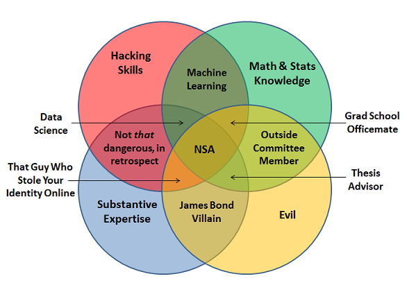
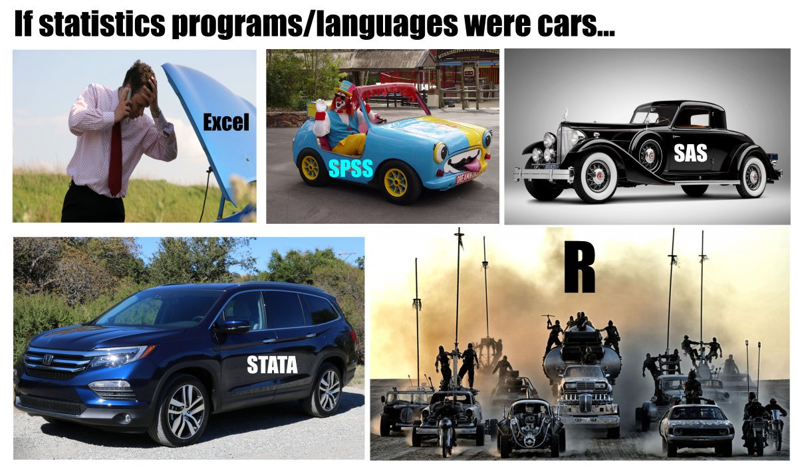

# Scope of the seminar

## Data Science im digitalen Unternehmen der Zukunft
## Data Science im digitalen Unternehmen
## Data Science
## Data Literacy
- Data literacy is the ability to read, understand, create and communicate data as information

# Fields of Data Science
## BI
## AI
## API
  - Data in applications
  - Self service
  - Server / client infrastructure

# Business Intelligence / Data Analysis

# Range of Data Responsibilities in a company
## Provide and maintain servers
  - Minimal amount of servers
  - Manage users
  - Maintain databases / DW
  - Secure the servers
  - Job Title: Data Engineer / DevOps

## Develop and maintain data flows
  - ETL: Extract, Transform, Load
  - Unstructured data → structured data
  - Batch processing vs. data streams
  - Make data easy accessible for Data Analysts
  - Monitor data pipelines
  - Raw data vs. aggregated data
  - Building caches vs. on-demand
  - Job Title: Data Engineer / Data Architect
  
## Derive value from data
  - Ad Hoc Analysis vs. Automated Analysis
  - Data visualization
  - Dashboards
  - KPI
  
## Key Performace Indicators
  - **S**pecific
  - **M**easurable  
  - **A**chievable 
  - **R**elevant 
  - **T**ime phased
  
## KPI: Product Management
  - DAU, WAU, MAU → daily, weekly, monthly users
  - Retention
  - Churn
  - Tourists
  - Return rate
  - Paying Customers (VIPs, Whales)
  - Overall Sales (Case: Happy Hour)

## KPI: Sales / Marketing
  - Conversion (Funnel)
  - LTV → live time value
  - Cohort Analysis
  - ROI → Return on invest (LTV / Cost per Acquisition)

## Case study: A/B testing
  - Strictly stick to groups
  - No self selection allowed
  - Optimal size?
  - Statistical vs. economical significance
  - Control the environment
  - Sequential A/B testing?

## KPI: Human Resources
  - Employer turnover
  - Applications
  - Conversion (Ad → Application)
  - Employer performance indicator
  
## KPI: Developer (Case Study: Game Design at Ubisoft)
  - Level Dropout
  - Time to completion
  - Completion (success) rate
  - Adoption of features
  
## Summary: Different Data Jobs
  - whodoeswhat.png
  - Flaws of last chart?
  
# Data Analysis
## Data Fallacies

## Cherry picking
  - Show only a subset of data that fit your claim
  - Malign manipulation or [confirmation bias](https://www.instagram.com/p/Bjz0RKtAMFp/)
  - Case study: Echo chamber, american economy, refugee crisis
  - Strategy: What I am not being told?
  - Strategic influence of data scientists in a company

## Data Dredging
  - Designing hypothesis *after* testing
  - Example: [xkcd comic](https://xkcd.com/882)
  - Strategy: Preregistering results
  - Strategy: Bonferroni correction
  
## Survivorship bias {data-background="Survivorship-bias.png"}

## Spurious correlation {data-background="storch.jpg"}
- [Examples](http://www.tylervigen.com/spurious-correlations)

## {data-background="1908.png"}
  
## Gerrymandering 
{height=600px}

## Gerrymandering
{height=600px}

## Gerrymandering
  - Beware of unintentional Gerrymandering in survey design
  - Case study: Winter event
  - [Great Article](https://www.nytimes.com/interactive/2017/10/03/upshot/how-the-new-math-of-gerrymandering-works-supreme-court.html)
  
## Sampling and survey biases
  - Response bias / Hawthorne effect (case: Flattr)
  - Undercoverage
  - Self-selection bias (voluntary response)
  - Convenience sampling
  - Non-response
  - Biased wording
  - Survey fatigue
  - Not paying attention
  - Order bias (Case study: Mobile study - ranking of ad annoyance)
  - Forced answer (no possibility to be neutral)
  - Short self test: http://bit.do/surveybias
 
## Sampling and survey bias cont.
 
  - ‘satisficing’: acquiescence, straight-lining, choosing the first reasonable response, or saying ‘don’t know’ or ‘no opinion’, skipping, speeding by giving low-effort responses, not fully answering open-text questions
  - Solution: attention checks
  - Problem: Removing "bad" participants → skewed demographics (psychographics)
  - Problem: Hawthorne effect?
  - Problem: Respondent recognizes check: low effort (past the trap, reduced trust)
  
## Gambler fallacy
  - Independent probabilities
  - No cosmic force to balance things out
  - Case: Monte Carlo in 1913: 26 times black
  - Case: 10 y/o me playing dice
  
## Simpsons paradox
  - (Weighted) arithmetical means are weird
  - Case: Rich person moving towns
  
## . {data-background="simpson.png"}

## McNamara Fallacy
  - Don't loose big picture over data
  - Data Scientist is ideally the last person who believes in data
  - KPI blindness
  - Always ask yourself and your stakeholder:
  - *What action is based on the dacta*?
  - *What results do you expect?*
  - *Why do you want to rely on quantitative rather than qualittive results?*
  
## Overfitting
Over-fitting is when you have a complicated model that gives worse predictions, on average, than a simpler model.
  - Case: Playing Fifa
  - Split your data to sample and test data (80/20 rule)
  
## Publication bias
  - In company: Stakeholder bias?
  - excursion: stakeholder
  - a stakeholder is a member of the "groups without whose support the organization would cease to exist"
  - classical stakeholder: shareholder, employees, government, union, creditors, suppliers, customers
  - broader sense: someone involved in the outcome of a project
  - data sense: recipient of data products
  - data department as a central service team (other service teams: design, legal, IT...)
  
## Summary bias
**Dont trust data summaries for comparison; always visualize**
{height=500px} 

# The Data Scientist
## Conway's Venn Diagramm


## Conway's Venn Diagramm extended


## Conway's Venn Diagramm extended (for realz)


## Conway in-depth
{height=600px}

## Which programming language
{height=600px}

## . {data-background="everywhere.jpg"}

## Exhibit 1
{height=600px}

## Data Scientist 

https://www.google.de/search?q=sexiest+job+of+the+21st+century
https://www.google.de/search?q=best+quality+of+life+jobs

## How to become a data scientist?
  - Study any domain you prefer, focus on empirical
  - Online courses
  - Find open data and play around
  - contribute to open source
  - competitions (Kaggle)
  - hackathons
  - dont be afraid to program
  - be spectical towards bootcamps
  - join local communities
  
# Communication
## How to make data requests
  - Formulate your problem, not a possible solution
  - Make clear how you will use the results
  - Think about possible output format
  - What is the desired level of precision?
  
## How to provide data to data scientists
  - Data should be as raw as possible
  - Additionaly provide a **tidy data** set or a rule book, how to clean it
  - Name and explain every variable

## The raw data

It is critical that you include the rawest form of the data that you have access to. This ensures
that data provenance can be maintained throughout the workflow.  Here are some examples of the
raw form of data:

* The strange [binary file](http://en.wikipedia.org/wiki/Binary_file) your measurement machine spits out
* The unformatted Excel file with 10 worksheets the company you contracted with sent you
* The complicated [JSON](http://en.wikipedia.org/wiki/JSON) data you got from scraping the [Twitter API](https://twitter.com/twitterapi)
* The hand-entered numbers you collected looking through a microscope
* Images, screenshots, sound files ...

## The raw data (cont.)
You know the raw data are in the right format if you: 

1. Ran no software on the data
1. Did not modify any of the data values
1. You did not remove any data from the data set
1. You did not summarize the data in any way

If you made any modifications of the raw data it is not the raw form of the data. Reporting modified data
as raw data is a very common way to slow down the analysis process, since the analyst will often have to do a
forensic study of your data to figure out why the raw data looks weird. (Also imagine what would happen if new data arrived?)
  
## How to name things

Inspired by Jenny Bryans [naming slides](https://www2.stat.duke.edu/~rcs46/lectures_2015/01-markdown-git/slides/naming-slides/naming-slides.pdf)
  
  - human readable
  - machine readable
  - plays well with ordering
  
## How to name things - human readable
  - name contains info on content
  - embrace the slug
  - easy to figure out what the heck something is, based on its name

## How to name things - human readable : example
Set 1                                   Set 2
------------------                 ----------
01_marshal-data.md                        1.md
02_pre-dea-filtering.md                   2.md
03_dea-with-limma-voom.md                 3.md
04_explore-dea-results.md                 4.md
90_limma-model-term-name-fiasco.md        90.md
figure                                    figure
helper01_load-counts.r                    helper1.r
helper02_load-exp-des.r                   helper2.r
helper03_load-focus-statinf.r             helper3.r

Which set of file(name)s do you want at 3a.m. before a deadline?

## How to name things - machine readable
> - search friendly: avoid spaces, punctuation, accented characters, case sensitivity
> - easy to compute on: deliberate use of delimiters

```
2018-06-23_DATASCIENCE_Kapitel-01_BI.md
2018-06-23_DATASCIENCE_Kapitel-02_Data-Fallacy.md
2018-05-18_STATISTIK_Kapitel-01_Mittelwerte.md
```

  - “_” underscore used to delimit units of meta-data I want later
  - “-” hyphen used to delimit words so my eyes don’t bleed

## How to name things - Ordering
  - put something numeric first
  - use the ISO 8601 standard for dates
  - left pad other numbers with zeros (01, 02, 10 vs. 1, 10, 2)

##
{height=700px}

##
{height=700px}

# Tidy data


# Vizualisations


# SQl Tutorial
# How to spread shit with spreadsheets
# Big Data
# Privacy
# AI / Machine learning
# API


  